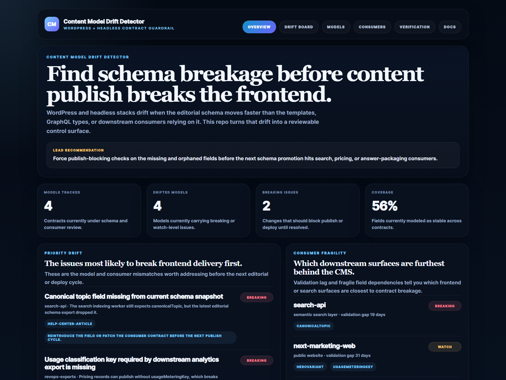
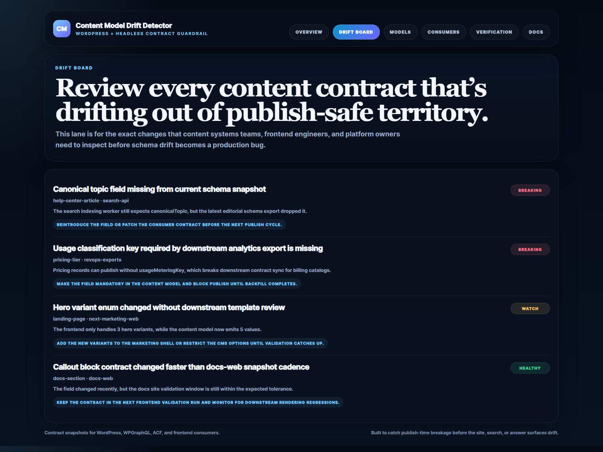
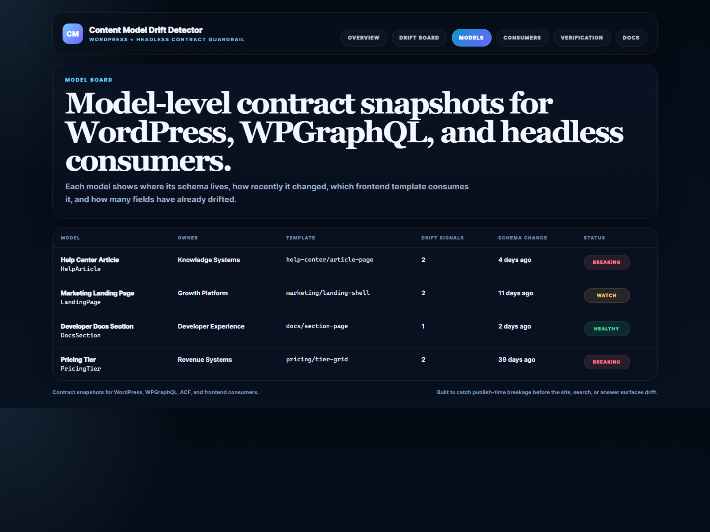
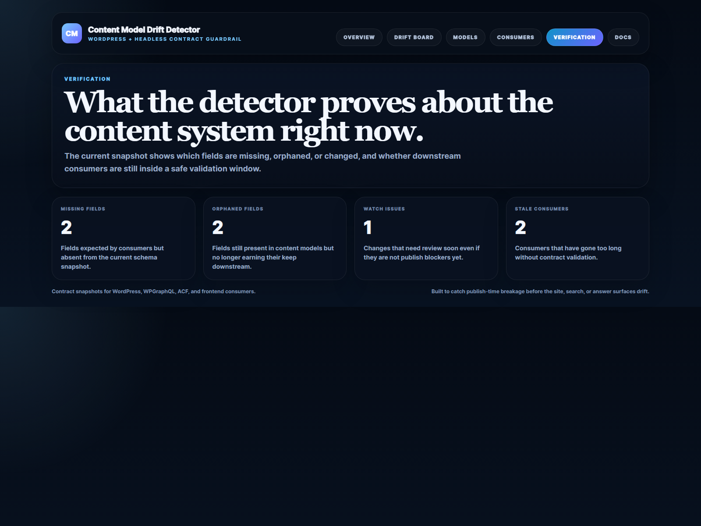

# Content Model Drift Detector

TypeScript and Express control surface for **catching WordPress and headless schema drift before content publish breaks downstream consumers**.

> **What this repo proves**
>
> Content breakage rarely starts with the frontend alone. It usually starts when editorial schema changes outrun the templates, GraphQL contracts, search packagers, or answer surfaces still depending on the old shape.

## Why this repo exists

Headless CMS stacks look clean until content models start moving under real operating pressure. ACF fields get renamed. WPGraphQL types shift. A landing-page template expects one hero variant while the editor publishes another. Search, docs, and AI answer surfaces keep consuming stale assumptions until someone finds the bug in production.

`content-model-drift-detector` models that reliability gap directly. It scores model drift, flags missing and orphaned fields, highlights stale consumer validation windows, and turns contract breakage into a reviewable queue instead of a mystery buried in page renders or deploy diffs.

## Screenshots






## What it includes

- Express app with HTML proof surfaces and JSON APIs
- sample WordPress, WPGraphQL, and headless consumer contracts
- drift scoring for changed, missing, and orphaned fields
- consumer validation-lag tracking for search, docs, and AI surfaces
- real browser-rendered README proof assets captured from the running app
- Vitest coverage plus demo and smoke validation scripts

## Local run

```powershell
cd content-model-drift-detector
npm install
npm run dev
```

Open:

- [http://127.0.0.1:5072/](http://127.0.0.1:5072/)
- [http://127.0.0.1:5072/drift-board](http://127.0.0.1:5072/drift-board)
- [http://127.0.0.1:5072/models](http://127.0.0.1:5072/models)
- [http://127.0.0.1:5072/consumers](http://127.0.0.1:5072/consumers)
- [http://127.0.0.1:5072/verification](http://127.0.0.1:5072/verification)
- [http://127.0.0.1:5072/docs](http://127.0.0.1:5072/docs)

## Validation

```powershell
npm run verify
npm run render:assets
```

## API routes

- `GET /api/dashboard/summary`
- `GET /api/models`
- `GET /api/drift-board`
- `GET /api/consumers`
- `GET /api/contracts`
- `GET /api/sample`

## Repo layout

```text
src/
  data/
  services/
docs/
scripts/
screenshots/
```
